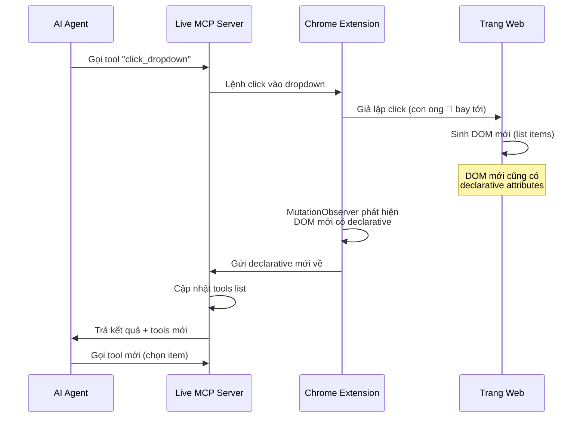
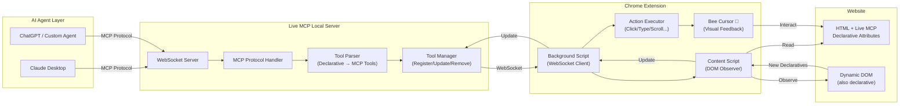
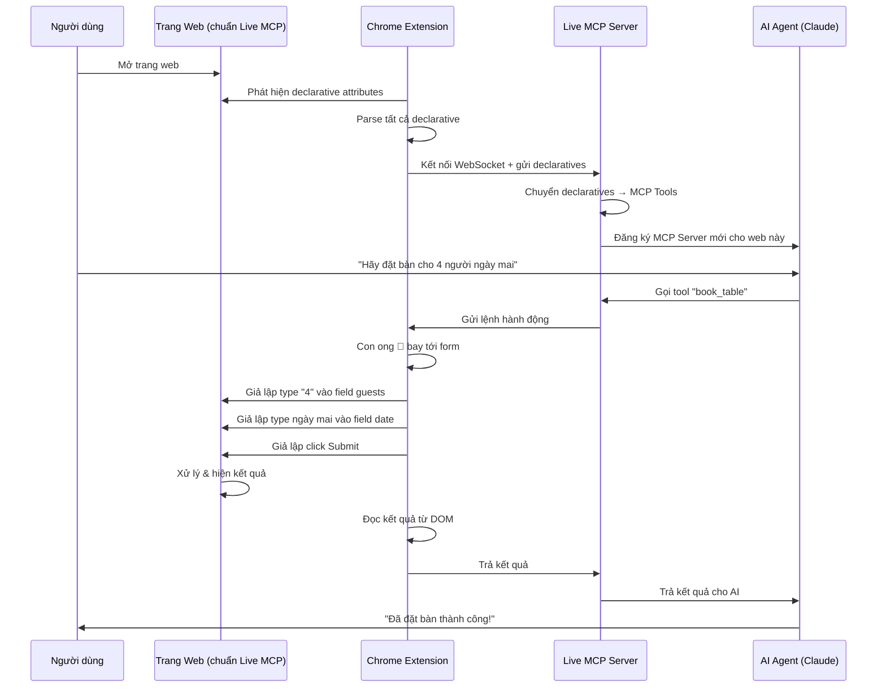
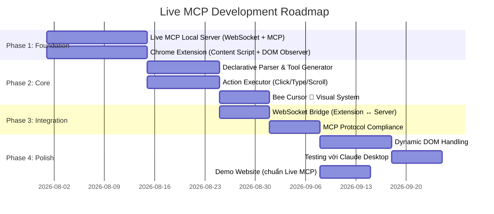

# 🔬 Nghiên Cứu Tài Liệu Live MCP — Phân Tích Toàn Diện

## 1. Tổng Quan Ý Tưởng Live MCP

**Live MCP** là một hệ thống cầu nối local, cho phép AI Agent (Claude, ChatGPT...) kết nối và tương tác với bất kỳ trang web nào hỗ trợ "chuẩn Live MCP" — một bộ khai báo declarative mở rộng trên nền tảng HTML.

### Triết lý cốt lõi

> [!IMPORTANT]
> **"Loại bỏ hoàn toàn Imperative API"** — Mọi tương tác của agent phải giống con người: dùng chuột và bàn phím, không gọi JavaScript trực tiếp. Nếu con người hoàn thành được workflow mà không cần gọi JS, agent cũng phải làm được.

---

## 2. So Sánh Với Chrome WebMCP Gốc

### 2.1 Chrome WebMCP — Declarative API

Chrome WebMCP (ra mắt tháng 5/2026, Chrome 146+) cung cấp cách khai báo tool cho AI agent bằng HTML attributes trên `<form>`:

| Attribute | Cấp độ | Mô tả |
|---|---|---|
| `toolname` | `<form>` | Tên duy nhất cho tool |
| `tooldescription` | `<form>` | Mô tả chức năng tool |
| `toolautosubmit` | `<form>` | Tự động submit khi agent gọi |
| `toolparamdescription` | `<input>`, `<select>`, `<textarea>` | Mô tả parameter cho AI |

**Ví dụ WebMCP gốc:**
```html
<form toolname="createSupportRequest" 
      tooldescription="Submits a request for customer support.">
  <label for="firstName">First Name</label>
  <input type=text name=firstName>
  
  <select name="select" required 
    toolparamdescription="Determines what team this request is routed to.">
    <option value="Customer happiness team">Return my purchase.</option>
    <option value="Distribution team">Check where my package is.</option>
  </select>
  
  <button type=submit>Submit</button>
</form>
```

**Browser tự động chuyển thành JSON Schema:**
```json
{
  "name": "supportRequestTool",
  "description": "Submit a request for support.",
  "inputSchema": {
    "type": "object",
    "properties": {
      "firstName": { "type": "string" },
      "select": {
        "type": "string",
        "enum": ["Customer happiness team", "Distribution team"],
        "description": "Determines what team this request is routed to."
      }
    }
  }
}
```

**Sự kiện hỗ trợ:**
- `toolactivated` — khi form được agent điền
- `toolcancel` — khi hành động bị hủy
- CSS pseudo-class `:tool-form-active`, `:tool-submit-active`
- `SubmitEvent.agentInvoked` — boolean phân biệt agent vs user
- `SubmitEvent.respondWith(Promise)` — trả kết quả cho agent

### 2.2 Chrome WebMCP — Imperative API (Cái Live MCP muốn loại bỏ)

Imperative API sử dụng JavaScript để đăng ký tool:

```javascript
await document.modelContext.registerTool({
  name: 'searchProducts',
  description: 'Search the product catalog',
  inputSchema: {
    type: 'object',
    properties: {
      query: { type: 'string' },
      category: { type: 'string' }
    },
    required: ['query']
  },
  execute: async (input) => {
    const results = await searchCatalog(input.query, input.category);
    return { content: [{ type: 'text', text: `Found ${results.length} products.` }] };
  }
});
```

**Các tính năng Imperative:**
- `document.modelContext.registerTool()` — đăng ký tool
- `document.modelContext.getTools()` — khám phá tools
- `document.modelContext.executeTool()` — thực thi tool  
- `toolchange` event — lắng nghe thay đổi
- Cross-origin iframe support với `exposedTo` và `fromOrigins`
- `AbortSignal` để hủy đăng ký/thực thi

---

## 3. Điểm Khác Biệt Quan Trọng: Live MCP vs WebMCP Gốc

```mermaid
graph TB
    subgraph "Chrome WebMCP Gốc"
        A["Browser nhận declarative<br/>từ <form> attributes"]
        B["Agent gọi tool qua<br/>browser API"]
        C["Browser tự động<br/>điền form & submit"]
        A --> B --> C
    end

    subgraph "Live MCP (Ý tưởng mới)"
        D["Chrome Extension<br/>đọc declarative từ DOM"]
        E["Local Server nhận<br/>& chuyển thành MCP tools"]
        F["AI Agent kết nối<br/>qua WebSocket"]
        G["Extension giả lập<br/>chuột/bàn phím (con ong 🐝)"]
        H["Extension lắng nghe<br/>DOM thay đổi → gửi lại"]
        D --> E --> F
        F --> G --> H --> E
    end
```



### Bảng so sánh

| Khía cạnh | WebMCP Gốc | Live MCP |
|---|---|---|
| **Phạm vi** | Chỉ hoạt động trong Chrome native | Hoạt động với mọi AI Agent bên ngoài |
| **Giao tiếp** | Browser API (`document.modelContext`) | WebSocket qua Local Server |
| **Tương tác** | Browser điền form tự động | Giả lập chuột/bàn phím (Playwright-style) |
| **Agent** | Agent tích hợp trong browser | Claude, ChatGPT, bất kỳ agent MCP-compatible |
| **Imperative** | Hỗ trợ đầy đủ | **Loại bỏ hoàn toàn** — chỉ Declarative |
| **DOM động** | Cần Imperative cho nội dung runtime | Dùng cơ chế "đợi sau hành động" |
| **Trực quan** | Không có hiệu ứng đặc biệt | Con ong 🐝 bay tới vị trí tương tác |
| **Chuẩn** | W3C Web Machine Learning CG | Mở rộng từ WebMCP Declarative |

---

## 4. Phân Tích Thách Thức "Thuần Declarative"

### 4.1 Vấn đề DOM Sinh Ra Tại Runtime

> [!WARNING]  
> Đây là thách thức lớn nhất. Chrome WebMCP gốc cần Imperative API cho các tool phức tạp (state management, navigation, dynamic content). Live MCP cần giải pháp thay thế.

**Giải pháp đề xuất trong tài liệu:**



**Cơ chế cốt lõi:**
1. **Mọi DOM mới sinh ra đều phải có declarative** — trang web phải annotate tất cả phần tử tương tác
2. **Agent "đợi" sau mỗi hành động** — giống Playwright `waitForSelector`, chờ DOM mới xuất hiện
3. **Extension lắng nghe MutationObserver** — chỉ lọc phần tử có declarative attributes
4. **Sự kiện cập nhật declarative** — broadcast khi có phần tử mới

### 4.2 Các "Hàm Chung Toàn Cục" Thay Thế Imperative

Thay vì Imperative API, Live MCP sẽ cung cấp một bộ hành động chuẩn giống con người:

| Hàm toàn cục | Mô tả | Tương đương Playwright |
|---|---|---|
| `click(selector, button)` | Click chuột trái/phải | `page.click()` |
| `type(selector, text)` | Gõ text | `page.type()` |
| `select(selector, value)` | Chọn option | `page.selectOption()` |
| `scroll(selector, direction)` | Cuộn trang | `page.evaluate(scroll)` |
| `hover(selector)` | Di chuột qua | `page.hover()` |
| `focus(selector)` | Focus element | `page.focus()` |
| `waitForElement(selector)` | Đợi element xuất hiện | `page.waitForSelector()` |
| `readDeclarative()` | Đọc lại tất cả declarative | N/A |
| `keyPress(key)` | Bấm phím | `page.keyboard.press()` |

---

## 5. Kiến Trúc Kỹ Thuật Đề Xuất



### 5.1 Luồng Hoạt Động Chi Tiết



### 5.2 Chuẩn Live MCP Declarative (Mở Rộng)

Dựa trên WebMCP gốc, Live MCP mở rộng thêm các attributes cho mọi loại phần tử tương tác (không chỉ form):

#### Cấp Form (giống WebMCP gốc)
```html
<form toolname="search_flights" 
      tooldescription="Search available flights"
      toolautosubmit>
  <input name="destination" toolparamdescription="Destination city">
  <input name="date" type="date" toolparamdescription="Travel date">
</form>
```

#### Cấp Phần tử tương tác (MỞ RỘNG Live MCP)
```html
<!-- Dropdown -->
<div livemcp-action="click" 
     livemcp-name="category_dropdown"
     livemcp-description="Mở menu danh mục sản phẩm"
     livemcp-wait="livemcp-item"
     livemcp-result-selector=".dropdown-item">
  Categories ▾
</div>

<!-- Các item sinh ra sau click (cũng có declarative) -->
<div class="dropdown-item" 
     livemcp-action="click"
     livemcp-name="select_electronics"
     livemcp-description="Chọn danh mục Điện tử">
  Electronics
</div>

<!-- Button -->
<button livemcp-action="click"
        livemcp-name="add_to_cart"
        livemcp-description="Thêm sản phẩm vào giỏ hàng">
  Add to Cart
</button>

<!-- Text input (không trong form) -->
<input livemcp-action="type"
       livemcp-name="search_input"
       livemcp-description="Ô tìm kiếm sản phẩm"
       livemcp-submit-key="Enter">
```

#### Thuộc tính mở rộng đề xuất

| Attribute | Mô tả |
|---|---|
| `livemcp-action` | Loại hành động: `click`, `type`, `select`, `hover`, `scroll` |
| `livemcp-name` | Tên tool (unique identifier) |
| `livemcp-description` | Mô tả cho AI agent |
| `livemcp-wait` | Selector/attribute cần đợi sau hành động |
| `livemcp-wait-timeout` | Timeout (ms) cho việc đợi |
| `livemcp-result-selector` | Selector để lấy kết quả sau hành động |
| `livemcp-group` | Nhóm các actions liên quan |
| `livemcp-order` | Thứ tự trong workflow |
| `livemcp-condition` | Điều kiện hiển thị/khả dụng |
| `livemcp-submit-key` | Phím gửi (cho input: Enter, Tab...) |

---

## 6. Con Ong 🐝 — Visual Feedback

### Đặc tả thiết kế

| Phần | Mô tả |
|---|---|
| **Hình dáng** | Con ong nhỏ thay thế cursor chuột |
| **Di chuyển** | Bay (animation) tới vị trí cần tương tác |
| **Chân trái** | Tương ứng click chuột trái |
| **Chân phải** | Tương ứng click chuột phải |
| **Mũi kim (miệng)** | Tượng trưng cây bút — đẩy lên xuống khi typing |

### Cách hoạt động
```
1. Agent gửi lệnh → Extension nhận
2. Con ong 🐝 xuất hiện tại vị trí hiện tại
3. Con ong bay (bezier curve animation) tới element đích
4. Tùy hành động:
   - Click trái: chân trái giẫm xuống
   - Click phải: chân phải giẫm xuống
   - Type: mũi kim từ miệng đẩy lên/xuống theo từng ký tự
5. Sau khi hoàn thành, con ong hover chờ lệnh tiếp
```

---

## 7. Đánh Giá Tính Khả Thi

### ✅ Ưu điểm

| # | Ưu điểm | Giải thích |
|---|---|---|
| 1 | **Agent-agnostic** | Mọi AI agent MCP-compatible đều dùng được |
| 2 | **Không phụ thuộc browser API** | Hoạt động qua Extension + WebSocket |
| 3 | **Trực quan** | Con ong giúp user theo dõi agent đang làm gì |
| 4 | **Giống con người** | Tương tác bằng chuột/bàn phím, tự nhiên hơn |
| 5 | **Tương thích WebMCP** | Tái sử dụng/mở rộng chuẩn declarative gốc |

### ⚠️ Thách thức

| # | Thách thức | Mức độ | Giải pháp đề xuất |
|---|---|---|---|
| 1 | **DOM động phức tạp** (SPA, Virtual DOM) | Cao | MutationObserver sâu + debounce |
| 2 | **Web không có declarative** | Cao | Cung cấp thư viện JS nhỏ để trang web tự thêm |
| 3 | **Shadow DOM** | Trung bình | Extension có quyền pierce shadow DOM |
| 4 | **Race conditions** (đợi DOM) | Trung bình | Timeout + retry + heuristics |
| 5 | **Bảo mật** | Cao | Chỉ kết nối local, permission model |
| 6 | **Canvas/WebGL** | Cao | Không thể declarative → ra ngoài scope |

---

## 8. Kết Luận & Khuyến Nghị

> [!TIP]
> **Live MCP là một ý tưởng rất sáng tạo** vì nó giải quyết 2 vấn đề lớn mà WebMCP gốc chưa xử lý:
> 1. **Agent bên ngoài browser** (Claude Desktop, ChatGPT) không thể dùng `document.modelContext`
> 2. **Trải nghiệm trực quan** — user không thấy agent đang làm gì trên trang web

### Lộ trình đề xuất



> [!IMPORTANT]
> **Câu hỏi cần xác nhận trước khi tiến hành:**
> 1. Bạn muốn bắt đầu từ component nào trước? (Local Server / Chrome Extension / Chuẩn Declarative?)
> 2. Ngôn ngữ/framework cho Local Server? (Node.js + ws? Deno? Python?)
> 3. Con ong 🐝 cần thiết kế đồ họa chi tiết trước hay dùng placeholder?
> 4. Có muốn hỗ trợ cả `toolname` WebMCP gốc (backward compatible) hay chỉ `livemcp-*` riêng?

---

> 📝 **Tài liệu này được nghiên cứu và viết bởi:**
> 
> **Claude Opus 4.6 (Thinking)** — Anthropic
> 
> 📅 Ngày: 31/07/2026
