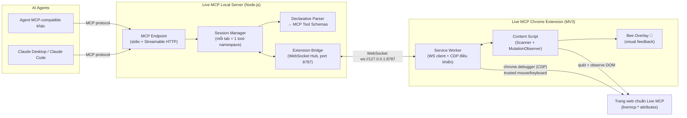
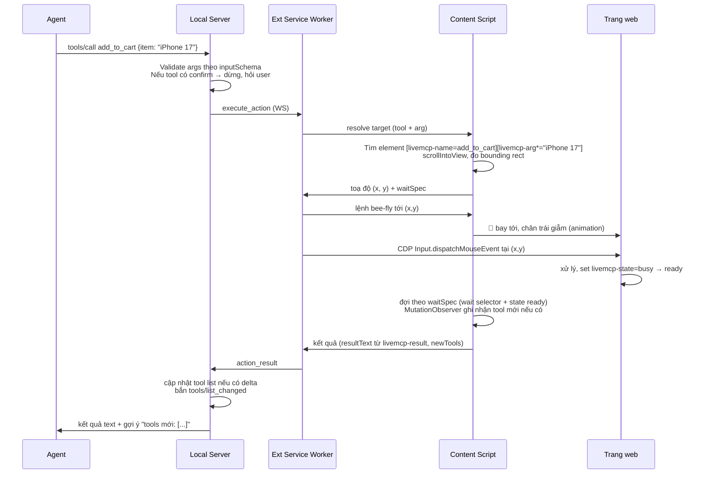

# Live MCP — Kiến Trúc Tổng Quan & Chi Tiết Kỹ Thuật Triển Khai

> Tài liệu cho developer tự triển khai hệ thống Live MCP. Đọc kèm `livemcp-declarative-spec.md`
> (đặc tả chuẩn khai báo mà trang web phải tuân theo).

---

## 1. Bức tranh toàn cảnh

Hệ thống gồm **3 thành phần**, trang web đạt chuẩn là thành phần thứ 4 (do bên thứ ba xây, theo spec):



**Phân vai ngắn gọn:**

| Thành phần | Trách nhiệm | KHÔNG làm gì |
|---|---|---|
| **Local Server** | Nói chuyện MCP với agent; dịch declarative → tool; định tuyến lệnh; giữ vòng đời session; chặn hành động `livemcp-confirm` chờ user duyệt | Không đụng DOM, không biết cách click |
| **Extension SW** | Kết nối WS tới server; thi hành hành động qua CDP; quản lý tab | Không parse schema, không nói MCP |
| **Content Script** | Quét declarative, observe mutation, **đưa focus vào phần tử**, tính toạ độ cho hành động chuột, đọc kết quả/resource, điều khiển con ong | Không tự thi hành click/type thật (việc của CDP) |
| **Trang web** | Khai báo đúng spec, cập nhật `livemcp-state` | Không cần biết Live MCP tồn tại lúc runtime — chỉ là HTML |

---

## 2. Quyết định kiến trúc quan trọng (đọc kỹ trước khi code)

### 2.1 Giả lập input phải qua `chrome.debugger` (CDP) — đây là quyết định số 1

Sự kiện tạo bằng `element.dispatchEvent(new MouseEvent(...))` có `isTrusted: false`. Web app hiện đại (React synthetic events vẫn nhận, nhưng focus/selection/default action của browser thì không), và triết lý dự án là "tương tác y như con người" → **bắt buộc dùng trusted events**:

- Extension attach `chrome.debugger` vào tab, dùng CDP:
  - `Input.dispatchMouseEvent` (mousePressed/mouseReleased/mouseMoved, button left/right, clickCount) — click, double click, drag, hover, scroll (`Input.dispatchMouseEvent type=mouseWheel`).
  - `Input.dispatchKeyEvent` + `Input.insertText` — gõ phím thật, phím tắt, Enter/Tab.
- Đây chính là cơ chế Playwright/Puppeteer dùng → hành vi đạt chuẩn "như con người" đã được chứng minh.
- **Đánh đổi phải chấp nhận:** Chrome hiện banner "LiveMCP is debugging this browser" khi debugger attach. Không có cách hợp lệ nào tắt banner — ghi rõ trong tài liệu người dùng, coi đó là *tính năng minh bạch* (user biết agent đang điều khiển).
- Permission cần trong manifest: `"debugger"`, `"tabs"`, `"scripting"`, host permissions theo site user cho phép.
- Attach lười: chỉ attach khi có phiên agent hoạt động, detach khi phiên kết thúc (banner biến mất).

### 2.2 Bàn phím là đường mặc định; toạ độ là ngôn ngữ của hành động chuột

> **Sửa lại so với draft v1.0.** Bản đầu chốt "toạ độ là ngôn ngữ chung của *mọi* hành động", với lập luận: nhờ vậy click canvas và click DOM dùng chung một code path. Lập luận đó đúng về mặt gọn mã nhưng sai về mặt đúng đắn, và đã trả giá bằng một lỗi tốn nhiều lượt gỡ ở M1 — xem `docs/consult/Q01`, `Q04`.

**Vì sao đổi.** Toạ độ là *sản phẩm của một trạng thái layout*: nó chỉ đúng trong khoảnh khắc đo. Dùng nó làm **danh tính** của phần tử là sai nguyên tắc — bất cứ thứ gì làm dịch layout giữa lúc đo và lúc bấm (ảnh vừa tải, font vừa đổi, `scrollIntoView` của một phép đo khác, sticky header co lại) đều biến toạ độ đúng thành toạ độ sai, và nó **hỏng lặng lẽ**: click trượt không báo lỗi, focus nằm nguyên ở ô cũ, cả chuỗi phím sau đó đổ nhầm vào đó.

Focus thì ngược lại: nó là **trạng thái bền của document**. Đặt xong là giữ nguyên cho tới lượt dispatch, không "cũ đi" theo layout.

**Đường mặc định — bàn phím, không toạ độ:**

| Loại phần tử | Cách tương tác | Cần toạ độ |
|---|---|---|
| text / number / email / url / tel / textarea | `focus()` → Ctrl+A → `Input.insertText` | không |
| date / time / datetime-local | `focus()` → ArrowLeft ×n → gõ chữ số | không |
| select | `focus()` → Home/End/mũi tên, **không bao giờ mở popup** | không |
| checkbox / radio | `focus()` đúng nút → Space | không |
| nút submit | `focus()` → Enter | không |
| canvas, hover, drag, scroll, phần tử **không** focus được | click chuột tại toạ độ đo ngay trước khi dispatch | **có** |

**Vì sao `el.focus()` không phá vỡ §2.1** (hai điểm đã xác nhận ở Q01):

- `el.focus()` chạy "focusing steps" của HTML spec; sự kiện `focus`/`focusin` sinh ra từ đó **vẫn `isTrusted: true`**. (Khác hẳn `el.click()` — spec bắt buộc dispatch synthetic, nên nó untrusted. Đó là lý do ta không bao giờ dùng `.click()`.) Nghĩa là đường bàn phím **không đưa một sự kiện untrusted nào vào trang**.
- Sự kiện từ `Input.dispatchKeyEvent` đi qua pipeline input của browser process nên **có cấp transient user activation**. Activation gắn với *hành động* (phím), không phải với bước lấy focus — nên `focus()` không cấp activation cũng không mất gì.
- Space/Enter trên button/checkbox/radio khiến UA phát một sự kiện `click` **trusted** (`detail: 0`). Widget nghe `click` trên phần tử chuẩn vẫn chạy trọn vẹn qua đường bàn phím.

**INVARIANT — user activation:** `Input.insertText` mô phỏng IME commit, **không** phải keydown, nên tự nó không cấp activation. Mọi chuỗi bước phải chứa ít nhất một phím thật trước bước cần activation. Hôm nay luôn đúng vì đường text-like mở đầu bằng Ctrl+A; đừng bỏ bước đó để "tối ưu".

**INVARIANT — `<select>`:** không bao giờ click vào select, không bao giờ Alt+Down/F4. Popup của select là cửa sổ native có vòng input riêng, nằm ngoài renderer: CDP không đưa phím vào được, kể cả Escape để đóng. Mở nó ra là tự nhốt phiên cho tới khi người dùng thật động tay.

**Nhánh chuột còn lại phải trả đủ ba khoản** (chi tiết ở Q04):
1. **Đo có kiểm độ ổn định** — đo hai lần cách nhau ~40ms, khác nhau thì đo lại. Cố ý không dùng `requestAnimationFrame` như Playwright: rAF đóng băng khi tab ở nền, đúng trạng thái làm việc bình thường của agent; còn `getBoundingClientRect()` ép tính layout đồng bộ bất kể trạng thái tab.
2. **`elementFromPoint` tại tâm trước khi bấm** — trượt thì huỷ hành động và nói rõ trúng vào đâu.
3. **Đối chiếu target của `mousedown` sau khi bấm** — kiểm tại thời điểm *thật*, bịt nốt khoảng trống giữa lúc đo và lúc dispatch.

**Đường nâng cấp đã biết, chưa làm:** dùng `Runtime.callFunctionOn` trong isolated world để lấy `objectId` của phần tử từ registry (không cần selector), rồi `DOM.scrollIntoViewIfNeeded` → `DOM.getContentQuads` → `Input.dispatchMouseEvent` — cả ba cùng kênh `chrome.debugger`, đo và bắn cùng một phía, khe hở co từ ~20ms về ~1–2ms. Đây cũng là lời giải đúng cho iframe (quads trả về theo hệ toạ độ viewport chính, không phải tự cộng offset). Xem §5.3.

### 2.3 MV3 Service Worker chết sau ~30s idle — phải thiết kế quanh nó

- Giữ WS sống: từ Chrome 116+, mọi hoạt động WebSocket reset timer SW → server gửi ping mỗi 20s là đủ giữ SW sống khi có phiên hoạt động.
- Vẫn phải code theo kiểu **stateless-recoverable**: mọi state phiên (tab nào đang pair, tool list đã gửi chưa) lưu `chrome.storage.session`; SW dậy lại → đọc storage → reconnect WS → resync.
- Content script mới là nơi giữ state DOM (registry declarative của trang) vì nó sống cùng trang.

### 2.4 Một tab = một MCP "sub-server" (namespace)

Agent kết nối **một** Local Server duy nhất. Mỗi tab chuẩn Live MCP khi được phát hiện sẽ tạo một *namespace* tool: `bookmytable__book_table`, `shopviet__add_to_cart`... Tool `livemcp_list_sites` cho agent biết đang có site nào mở. Tab đóng → toàn bộ tool namespace đó biến mất + `notifications/tools/list_changed`.

Lý do không tạo N server cho N tab: Claude Desktop/agent cấu hình MCP server tĩnh trong config — không thể mọc server động. Namespace hóa tool là cách đúng với hiện trạng hệ sinh thái MCP.

### 2.5 Server expose MCP qua cả stdio và Streamable HTTP

> **Sửa ngày 09/09/2026 — hai transport là quan hệ CỘNG, không phải quan hệ HOẶC.**
> Bản đầu của mục này liệt kê stdio và HTTP như hai lựa chọn, và mã lần đầu hiện
> thực đúng như vậy: `--http` loại trừ `--stdio`. Sai, và cái sai lộ ra ngay khi
> dùng thật — cả hai transport đều cần **cùng một WS hub 8787**, mà cổng đó chỉ
> một tiến trình giữ được. Nghĩa là "chọn một trong hai" không phải một lựa chọn
> cấu hình, nó là *"hôm nay bạn chỉ được dùng Claude Code hoặc claude.ai"*. Nay
> `--http` **bật thêm** HTTP bên cạnh stdio trong cùng tiến trình.

- **stdio**: để khai báo trong config Claude Desktop / Claude Code (cách phổ biến nhất hiện nay).
- **Streamable HTTP**: `POST /mcp`, mặc định `127.0.0.1:8788`, bật bằng `--http`. Dùng `@modelcontextprotocol/sdk` (TypeScript) — có sẵn cả hai transport + `tools/list_changed`.
- Quan trọng: server phải hỗ trợ **dynamic tool list** và bắn `notifications/tools/list_changed` mỗi khi declarative thay đổi — đây là xương sống của mẫu "hành động → đợi → tool mới".

**Mỗi kết nối HTTP là một `Server` mới, và điều đó sinh ra một lớp rò rỉ không có
ở stdio.** Với stdio, `Server` sống bằng tuổi tiến trình nên đăng ký
`store.onChange` một lần là xong. Với HTTP, mỗi lần claude.ai nối lại là một
`Server` mới đăng ký thêm một listener; không gỡ ở `server.onclose` thì số
listener chỉ có tăng, mỗi cái gọi `sendToolListChanged` trên một server đã chết.

**Ba lớp cửa vào** (`server/src/http/guard.ts`), mỗi lớp chặn một thứ khác nhau —
đây là lý do không lớp nào thay được lớp nào:

| Lớp | Chặn gì | Vì sao không bỏ được |
|---|---|---|
| `Origin` | trình duyệt | không client MCP hợp lệ nào chạy trong trang web |
| `Host` | DNS rebinding | tên miền của kẻ tấn công trỏ về `127.0.0.1` |
| `Authorization: Bearer` | mọi thứ đến từ internet qua tunnel | Origin/Host không có ý nghĩa với client không phải trình duyệt |

**Token HTTP tách khỏi token pairing WS**, cố ý không dùng chung giá trị: token
pairing chỉ nằm trên máy này, còn token HTTP đi qua tunnel và nằm trong cấu hình
của một dịch vụ bên ngoài. Dùng chung thì lộ cái sau là mất luôn cái trước, và
xoay một cái bắt xoay cả cái kia.

`--http-no-auth` (cho trường hợp Cloudflare Access đã chắn phía trước) **cảnh báo
to mỗi lần khởi động**. Đây là N2 áp lên cấu hình chứ không lên mã: một endpoint
không xác thực mà im lặng chạy được là thứ không ai phát hiện ra cho tới lúc đã muộn.

---

### 2.6 Kênh Ask chạy song song, không đi qua đường declarative

*(Thêm ngày 09/09/2026 — tính năng làm ngoài lộ trình, xem `livemcp-roadmap.md`.)*

Widget "hỏi trợ lý" nổi trên **mọi** trang: người dùng bôi đen một đoạn hoặc gõ
một câu, agent trả lời ngay tại tab đó. Nó dùng chung WS hub và chung tiến trình
server với đường declarative, nhưng **không dùng chung gì khác** — và ranh giới
đó là quyết định kiến trúc, không phải chi tiết cài đặt:

- **Content script riêng (`ask.js`), không gộp vào bundle scanner.** Hai thứ có
  điều kiện sống khác nhau: scanner chỉ có việc trên trang khai `<meta name="livemcp">`,
  widget phải có mặt khắp nơi. Gộp lại thì mỗi lần sửa widget là một lần có nguy
  cơ làm gãy đường declarative — thứ đang chạy đúng và có lưới E2E bảo vệ.
- **Không đụng `SessionStore`.** Câu hỏi sống trong `AskStore` riêng; tool kênh
  Ask có mặt trong `tools/list` kể cả khi chưa có trang chuẩn nào mở.
- **Service worker không giữ trạng thái kênh Ask** — chỉ chuyển tiếp. MV3 giết SW
  bất cứ lúc nào, nên mọi thứ nó nhớ đều là thứ sẽ mất. Nguồn sự thật ở server,
  bản sao để hiển thị ở `chrome.storage.local` của widget.
- **Widget không bao giờ tự đọc nội dung trang.** Chỉ gửi câu người dùng gõ và
  đoạn họ chủ động bôi đen. Cần thêm ngữ cảnh thì agent phải hỏi ngược bằng
  `livemcp_ask_followup` — tức là người dùng vẫn là người quyết định cái gì rời trang.

**Đảo chiều so với phần còn lại của hệ:** ở đường declarative, agent là bên chủ
động gọi. Ở kênh Ask, **người dùng** là bên chủ động và agent là bên chờ. Đó là
lý do `livemcp_ask_wait` **chặn** (tới 55s) thay vì trả về ngay: agent gọi một
lần rồi tự lặp, người dùng không phải nhắc lại từng câu. 55s nhắm dưới timeout
tool-call ~60s của claude.ai — vượt trần thì client bỏ cuộc trước server và agent
nhận một lỗi transport không nói gì, mất luôn khả năng lặp vòng.

**Ba trạng thái, không phải hai.** `pending → claimed → answered`, cộng một cờ
`delivered` riêng. `claimed` tồn tại vì nó là nấc rẻ nhất mà đổi cảm giác chờ
nhiều nhất: người dùng biết có ai đó đang xử lý. `delivered` tách khỏi `answered`
vì agent trả lời xong **không** có nghĩa widget đã nhận — tab có thể đang F5 đúng
lúc đó; widget gửi `ask_hello` khi dựng lại và server giao lại phần chưa nhận.

**Claim có TTL (180s) và có nhịp sweep chủ động (15s).** Phiên claude.ai biến mất
giữa chừng mà không ai báo (đóng tab, hết context) là chuyện thường. Không TTL thì
câu hỏi khoá vĩnh viễn ở "đang xử lý". Và sweep phải **chủ động** chứ không dọn
lười lúc đọc: khi một claim hết hạn, phải có ai đó đánh thức `ask_wait` đang chặn
ở phiên khác — dọn lười thì mọi phiên cùng chặn và không lượt gọi nào tới để dọn.

---

## 3. Giao thức nội bộ Extension ↔ Server (WebSocket)

JSON messages qua `ws://127.0.0.1:8787`. Định nghĩa tối thiểu v1:

### 3.1 Extension → Server

```jsonc
// Khi tab load trang có meta livemcp — khai sinh session
{ "type": "site_announce", "tabId": 12, "url": "https://shopviet.vn",
  "app": "ShopViet", "description": "...", "specVersion": "1.0" }

// Snapshot toàn bộ declarative sau lần quét đầu (và sau navigation)
{ "type": "declarative_snapshot", "tabId": 12, "seq": 1,
  "tools": [ /* mảng ToolDecl, xem 3.3 */ ],
  "resources": [ /* mảng ResourceDecl */ ] }

// Thay đổi tăng dần từ MutationObserver (debounce 150ms)
{ "type": "declarative_delta", "tabId": 12, "seq": 2,
  "added": [...], "removed": ["tool_name"], "changed": [...] }

// Kết quả thi hành một action
{ "type": "action_result", "tabId": 12, "actionId": "a-91",
  "status": "ok" | "timeout" | "error" | "navigated",
  "resultText": "Đặt bàn thành công, mã BK-1023",
  "newTools": ["pick_category_electronics"],   // tool xuất hiện nhờ hành động này
  "durationMs": 840 }

// Tab đóng / rời trang
{ "type": "site_gone", "tabId": 12 }

// --- Kênh Ask (chạy trên MỌI trang, không cần meta livemcp) ---

// Người dùng gửi một câu hỏi từ widget
{ "type": "ask_question", "tabId": 12, "questionId": "q-7a3f",
  "url": "https://vnexpress.net/...", "title": "...",
  "text": "đoạn này nói gì vậy?",
  "selection": "…đoạn người dùng CHỦ ĐỘNG bôi đen…",   // không bao giờ tự lấy
  "ts": 1757400000000 }

// Widget vừa dựng lại (mở panel, hoặc content script sống lại sau F5)
// → xin phần chưa giao. Không có message này thì mọi câu trả lời về đúng
//   lúc trang đang tải lại đều rơi mất, và không ai biết.
{ "type": "ask_hello", "tabId": 12, "url": "https://..." }

// Widget xác nhận đã hiển thị câu trả lời — server mới được dọn
{ "type": "ask_delivered", "tabId": 12, "questionId": "q-7a3f" }

// Người dùng rút lại câu hỏi trước khi có ai trả lời
{ "type": "ask_cancel", "tabId": 12, "questionId": "q-7a3f" }
```

### 3.2 Server → Extension

```jsonc
// Lệnh thi hành tool
{ "type": "execute_action", "tabId": 12, "actionId": "a-91",
  "tool": "add_to_cart",
  "args": { "item": "iPhone 17" },          // args người dùng truyền (đã validate schema)
  "formFill": null }                          // hoặc {guests: 4, date: "..."} với form tool

// Đọc resource
{ "type": "read_resource", "tabId": 12, "actionId": "a-92", "resource": "cart_items" }

// Ping keepalive (giữ MV3 SW sống)
{ "type": "ping" }

// --- Kênh Ask ---

// Một phiên agent đã nhận câu hỏi này
{ "type": "ask_claimed", "tabId": 12, "questionId": "q-7a3f" }

// Câu trả lời cuối cùng. Widget PHẢI hồi ask_delivered.
{ "type": "ask_answer", "tabId": 12, "questionId": "q-7a3f", "markdown": "..." }

// Agent hỏi ngược khi câu hỏi thiếu ngữ cảnh
{ "type": "ask_followup", "tabId": 12, "questionId": "q-7a3f", "text": "bạn đang xem mục nào?" }

// Claim hết hạn, câu hỏi quay lại hàng đợi — widget lùi trạng thái
{ "type": "ask_released", "tabId": 12, "questionId": "q-7a3f" }
```

Bốn message kênh Ask đi bằng `bridge.sendToTab()` chứ không bằng `dispatch()`:
ở đây **không có cặp request/response**. Xác nhận đi đường riêng (`ask_delivered`)
vì widget có thể đang tải lại trang đúng lúc câu trả lời tới — chờ đồng bộ tại
chỗ gửi sẽ chỉ sinh ra timeout giả.

### 3.3 Cấu trúc `ToolDecl` (content script sinh ra, server chỉ việc map sang MCP)

```jsonc
{
  "name": "add_to_cart",
  "description": "Thêm sản phẩm vào giỏ hàng",
  "kind": "element" | "form",
  "action": "click",
  "args": [ { "name": "item", "enum": ["iPhone 17", "Galaxy S26"] } ],  // gộp từ livemcp-arg
  "formSchema": null,          // với kind=form: schema từ các input (đã convert theo bảng ở spec §4)
  "wait": "#cart-badge[livemcp-state='ready']",
  "waitGone": null,
  "waitTimeout": 5000,
  "resultSelector": "#cart-badge",
  "confirm": null,             // hoặc câu cảnh báo từ livemcp-confirm
  "navigate": false,
  "available": true            // false nếu disabled/hidden
}
```

**Nguyên tắc phân lớp:** content script chuẩn hóa DOM → `ToolDecl` (mọi hiểu biết về attribute nằm ở đây); server chuyển `ToolDecl` → MCP tool + inputSchema (mọi hiểu biết về MCP nằm ở đây). Hai bên không giẫm việc nhau — dễ test độc lập.

---

## 4. Luồng thi hành một tool (end-to-end)



**Chi tiết quan trọng trong luồng:**

1. **Type text**: bay ong tới ô → CDP click để focus → với mỗi ký tự `Input.dispatchKeyEvent` (keyDown/keyUp) hoặc `Input.insertText` cho chuỗi dài (nhanh hơn, vẫn trusted) → mũi kim ong nhấp theo nhịp ký tự → `livemcp-submit-key` nếu có.
2. **Form tool**: server gửi `formFill` map field→value; content script xếp thứ tự field theo DOM order; điền tuần tự từng field như trên rồi click submit.
3. **Kết quả trả agent** luôn gồm 3 phần: `resultText` (từ `livemcp-result`), trạng thái (`ok/timeout/error/navigated`), và danh sách tool mới/mất đi — để agent "nhìn thấy" hệ quả hành động của mình mà không cần hỏi lại.
4. **Timeout**: trả `status=timeout` kèm snapshot `livemcp-state` hiện tại của vùng đợi — agent tự quyết retry. Server không tự retry (tránh double-click "Thanh toán").

---

## 5. Content Script — chi tiết kỹ thuật cần lưu ý

### 5.1 Scanner & Registry

- Quét lần đầu khi `document_idle`: `querySelectorAll('[livemcp-name],[toolname],[livemcp-resource],[livemcp-canvas-map]')`.
- Duy trì `Map<toolName, ElementRef[]>` (mảng vì tool tham số hóa có nhiều element cùng name). **Giữ tham chiếu element trực tiếp**, không lưu selector — DOM churn khiến selector mồ côi; element ref + `isConnected` check là tin cậy nhất.
- Gộp `livemcp-arg`: các element cùng name → một ToolDecl, enum args hợp nhất. Khi thi hành, match element theo đúng cặp arg.

### 5.2 MutationObserver — lọc đúng, debounce đúng

```js
new MutationObserver(muts => scheduleRescan(muts)).observe(document.documentElement, {
  subtree: true, childList: true,
  attributes: true,
  attributeFilter: ['livemcp-state', 'livemcp-arg', 'disabled', 'hidden']
});
```

- **Không rescan cả trang mỗi mutation.** Chỉ xử lý node added/removed có (hoặc chứa) phần tử mang `livemcp-*`; attribute change chỉ quan tâm danh sách filter trên.
- Debounce 150ms gom delta; nhưng tín hiệu `livemcp-state` chuyển sang `ready` trong lúc **đang có action đợi** thì xử lý ngay lập tức (không debounce) — đây là đường nóng của cơ chế đợi.
- Shadow DOM: với web greenfield, spec yêu cầu dùng light DOM cho phần tử khai báo, hoặc shadow root phải là `open`. Content script đệ quy observe các open shadow root gặp được (giữ danh sách các observer để disconnect khi root biến mất).

### 5.3 Iframe cùng origin / khác origin

- Same-origin iframe: content script với `"all_frames": true` chạy trong từng frame, mỗi frame tự quét và báo về SW kèm `frameId`. **Không tự cộng offset iframe bằng tay** — phép cộng thủ công chết ở bốn chỗ: gốc document con nằm ở *content box* (phải cộng cả border lẫn padding, không chỉ `rect.left`); iframe lồng nhau đòi cộng đệ quy; iframe có transform/zoom làm CSS px của frame con ≠ CSS px của frame cha (sai *về bản chất*, không phải sai số); và cross-origin thì `frameElement` là null. Lời giải: đo bằng `DOM.getContentQuads` từ session top-level — quads trả về theo hệ toạ độ viewport chính, đúng thứ `Input.dispatchMouseEvent` cần. Xem §2.2 "đường nâng cấp".
- Shadow DOM **không** tạo hệ toạ độ mới: `getBoundingClientRect()`/quads đã ở toạ độ viewport của frame, không phải cộng gì. Chỗ duy nhất shadow DOM khác biệt là `activeElement` và `elementFromPoint` — phải hỏi `getRootNode()` chứ không phải `document`.
- OOPIF (cross-origin khác process) cần attach session riêng cho frame (`Target.setAutoAttach` flatten). Hành vi từng đổi giữa các bản Chrome → làm sau, và chỉ làm khi đã có ca E2E riêng cho nó.
- Cross-origin iframe: mỗi frame vẫn có content script riêng (nếu host permission cho phép) — hoạt động bình thường vì mọi giao tiếp đi qua SW chứ không qua trang cha. Nếu không có permission → vùng đó ngoài scope, ghi rõ trong tài liệu user.

### 5.4 Đọc kết quả & resource

- `livemcp-result`/`read_*`: lấy `innerText` sau khi vùng đạt `ready`, chuẩn hóa whitespace, cắt trần độ dài (mặc định 4.000 ký tự, cấu hình được) để không phá context window của agent.
- `<script type="application/livemcp+json">`: parse JSON, trả structured content (MCP `structuredContent`) — ưu tiên hơn innerText.
- Table → mảng object theo header nếu có `<th>`.

### 5.5 Bee Cursor 🐝

- Một overlay layer duy nhất: element `position: fixed; z-index: 2147483647; pointer-events: none` chứa SVG con ong. **`pointer-events: none` là bắt buộc** — con ong không bao giờ được chặn chính cú click nó đang biểu diễn.
- Animation bay: Web Animations API theo đường bezier (`offset-path` hoặc keyframes transform), thời gian bay tỉ lệ khoảng cách, có tốc độ tối đa (~250ms cho đường ngắn, trần ~900ms) để không làm chậm workflow.
- Đồng bộ hành động: SW chờ content script báo "ong đã tới nơi" rồi mới dispatch CDP — hiệu ứng và hành động khớp nhau; nếu animation lỗi thì vẫn dispatch (visual không bao giờ được chặn chức năng).
- Trạng thái ong: `idle` (đậu góc màn hình) → `flying` → `acting` (chân trái/phải giẫm khi click trái/phải, kim mũi nhấp khi type) → `waiting` (lơ lửng cạnh vùng đang đợi) → về `idle`.
- Render trong shadow root riêng của overlay để CSS trang không phá được style con ong.

---

## 6. Local Server — chi tiết kỹ thuật cần lưu ý

### 6.1 Stack đề xuất

- **Node.js 22 + TypeScript**, `@modelcontextprotocol/sdk` (MCP), `ws` (WebSocket hub). Một package, chạy `npx livemcp-server` hoặc service.
- Cấu trúc module: `mcp/` (transport + tool registry động) · `bridge/` (WS hub, quản lý extension connections) · `parser/` (ToolDecl → MCP schema) · `policy/` (confirm gate, sanitizer) · `store/` (session state).

### 6.2 Vòng đời session & đồng bộ

- **`pageId` + `seq`** trong mọi message declarative. Server bỏ message có `pageId` khác lần load hiện tại, **rồi mới** bỏ message có `seq` cũ hơn — hai điều kiện bắt hai chuyện khác nhau: `pageId` bắt *"của trang khác"*, `seq` bắt *"cũ hơn trong cùng trang"*.

  > **Sửa ngày 03/08/2026.** Bản đầu chỉ có `seq` và mô tả nó là *"tăng dần theo tab"*. Sai: `seq` là bộ đếm sống trong **content script**, mà content script chết theo mỗi lần điều hướng — trang mới đếm lại từ 0. Nên một delta trễ của trang cũ (`seq=7`) luôn lớn hơn `seq` của trang mới (`seq=1`) và **lọt qua** đúng cái chốt định chặn nó. Ca kiểm: `packages/server/src/store/sessions.test.ts`.
- Navigation = `site_gone` + `site_announce` + snapshot mới (extension chịu trách nhiệm phát đúng thứ tự).
- Extension mất kết nối WS → server giữ tool list 30s (grace period cho SW MV3 hồi sinh) rồi mới gỡ; agent gọi tool trong lúc mất kết nối nhận lỗi rõ ràng "extension disconnected, đang chờ kết nối lại".

### 6.3 Policy layer (bảo mật — không được cắt xén khi triển khai)

> **Sửa mô hình đe doạ, 02/08/2026.** Bản đầu của mục này ngầm coi `127.0.0.1` là
> một biên giới: chỉ *tiến trình local* mới nối vào được. Sai. Handshake WebSocket
> không bị CORS chặn, nên **bất kỳ trang web nào** đang mở trong bất kỳ trình
> duyệt nào cũng mở được `ws://127.0.0.1:8787`. Đây là kịch bản drive-by thật, và
> nó đã mở suốt từ M0 tới M1. Vì vậy mục 1 và 4 dưới đây **đã được kéo lên M1.5**,
> không còn nằm ở M4 (xem `livemcp-roadmap.md` R02).

1. ✅ **WS chỉ bind `127.0.0.1`, và handshake có hai lớp.** *(M1.5 — đã làm)*
   - **Token** = xác thực: server sinh token lần chạy đầu, lưu `~/.livemcp/token`, user dán vào popup extension một lần. Chặn tiến trình local tuỳ ý.
   - **Chặn origin web** = chặn đúng lớp tấn công trên: yêu cầu upgrade mang `Origin: http(s)://…` bị từ chối. Trang web **không giả mạo được** header này, nên đây là bộ lọc mà kẻ tấn công qua trình duyệt không lách được kể cả khi đoán đúng cổng.
   - Hai lớp có vai khác nhau, cố ý không gộp. Mã: `server/src/bridge/handshake.ts`.
2. **Origin allowlist:** lần đầu gặp một origin mới, extension hỏi user "Cho phép agent điều khiển shopviet.vn?" — lưu quyết định. Không allowlist → không quét, không thi hành. *(M4)*
3. **Confirm gate:** tool có `confirm` → `tools/call` trả về yêu cầu xác nhận (MCP elicitation nếu client hỗ trợ; fallback: trả message yêu cầu agent hỏi user rồi gọi lại với `confirmed: true` — cờ này do server thêm vào schema, và server chỉ chấp nhận sau khi đã phát yêu cầu xác nhận tương ứng). *(M4)*
4. ✅ **Một cửa duy nhất cho text từ web.** *(M1.5 — đã làm)* Mọi chuỗi từ trang đi tới agent qua `server/src/mcp/agentText.ts`: cắt trần, gỡ ký tự vô hình/bidi, vô hiệu hoá code fence, gắn nhãn nguồn. Giá trị nằm ở chỗ **có đúng một cửa**, không ở độ tinh vi của bộ lọc — M4 làm giàu nội dung lọc mà không phải truy lại từng đường text.
   **Và phải nhớ:** không tồn tại phòng thủ kín cho prompt injection. Strip mẫu chỉ thị ("ignore previous instructions"…) là trò mèo vờn chuột. Sanitizer giảm **xác suất**; thứ chặn **trần thiệt hại** là danh sách hành động agent được phép — confirm gate, allowlist, rate limit. Câu thiết kế đúng không phải *"lọc được chưa"* mà là ***"nếu injection thành công, nó làm được tối đa những gì?"***
5. **Từ chối type vào `input[type=password]`** trừ khi user bật rõ trong settings.
6. Rate limit hành động (mặc định ~2 action/giây/tab) — vừa an toàn vừa khớp nhịp con ong. *(M4)*

> **Sửa lần hai, 09/09/2026 — bề mặt tấn công vừa nở ra, và phép thử hai vế của
> M1.5 nay cho kết quả khác cho mục 2/3/6.** Phép thử đó là: việc nào *(rẻ ∧ đóng
> lỗ đang mở hôm nay)* thì làm ngay, việc nào *(đắt ∨ bảo vệ người chưa tồn tại)*
> thì để M4. Hai thứ vừa làm xong đổi vế cho một phần M4:
>
> - **`--http` + tunnel đưa endpoint MCP ra internet.** Ba lớp cửa ở §2.5 chặn
>   *ai vào được*, nhưng không chặn *vào rồi làm được gì*. Ai qua cửa là điều
>   khiển được trình duyệt của chủ máy, không giới hạn tốc độ, không xác nhận.
> - **Kênh Ask là một đường text hai chiều mới từ trang tới agent**, chạy trên
>   *mọi* trang chứ không chỉ trang đã khai declarative. Text đã đi qua đúng một
>   cửa `toAgentText()` (mục 4) nên phần *xác suất* có được chăm, nhưng phần
>   *trần thiệt hại* thì vẫn y nguyên — mà đó mới là phần quyết định.
>
> Kết luận: **confirm gate (mục 3) và rate limit (mục 6) không còn là "bảo vệ
> người dùng tương lai"** — chúng bảo vệ chủ dự án, hôm nay, mỗi lần bật `--http`.
> Origin allowlist (mục 2) vẫn ở M4. Xem `livemcp-roadmap.md` mục M4.

### 6.4 Tool hệ thống (server tự expose, không đến từ web)

| Tool | Công dụng |
|---|---|
| `livemcp_list_sites()` | Liệt kê site/tab đang kết nối + mô tả |
| `livemcp_get_tools(site)` | Tool list hiện tại của một site (agent tự làm mới hiểu biết) |
| `livemcp_wait(site, selector?, timeoutMs)` | Cho agent chủ động đợi thêm (học "cách đợi của Playwright") |
| `livemcp_read_page(site)` | Đọc toàn bộ resource + trạng thái các vùng `livemcp-state` — "con mắt" tổng của agent |

**Tool kênh Ask** (§2.6) — luôn có mặt, kể cả khi chưa trang chuẩn nào mở:

| Tool | Công dụng |
|---|---|
| `livemcp_ask_wait(timeoutMs?)` | **Chặn** tới 55s chờ câu hỏi kế tiếp, rồi claim nó. Đây là chỗ agent tự lặp vòng. |
| `livemcp_ask_list()` | Xem hàng đợi mà không claim — dùng để nhìn, không dùng để lặp |
| `livemcp_ask_answer(questionId, markdown)` | Trả lời; câu trả lời về đúng tab đã hỏi |
| `livemcp_ask_followup(questionId, text)` | Hỏi ngược người dùng khi thiếu ngữ cảnh |

Mọi text của câu hỏi đi qua `toAgentText()` / `scrubWebText()` như mọi text khác
từ web (§6.3 mục 4) — kênh mới **không** được mở thêm một cửa thứ hai.

---

## 7. Cấu trúc repo đề xuất (monorepo)

```
livemcp/
├── packages/
│   ├── server/            # Local Server (Node + TS)
│   │   ├── src/mcp/       # MCP transports, dynamic registry, tool hệ thống + kênh Ask
│   │   ├── src/http/      # Streamable HTTP + guard 3 lớp (§2.5)
│   │   ├── src/bridge/    # WS hub + protocol messages
│   │   ├── src/parser/    # ToolDecl → MCP schema
│   │   ├── src/store/     # session state, token, hàng đợi Ask
│   │   └── src/policy/    # confirm gate, sanitizer, allowlist  (M4, chưa có)
│   ├── extension/         # Chrome Extension MV3
│   │   ├── src/sw/        # service worker: WS client, CDP executor, tab mgr
│   │   ├── src/content/   # scanner, observer, waiter, reader, coordinator
│   │   ├── src/ask/       # widget hỏi trợ lý — content script RIÊNG (§2.6)
│   │   ├── src/bee/       # 🐝 overlay (SVG + Web Animations)  (M5, chưa có)
│   │   └── manifest.json
│   ├── protocol/          # Types chung: ToolDecl, WS messages (share server+extension)
│   └── demo-site/         # Trang demo đạt chuẩn (kiêm test bed): shop + dropdown + canvas mẫu A/B/C
├── docs/
│   ├── livemcp-declarative-spec.md
│   └── livemcp-architecture.md
└── package.json           # npm workspaces
```

`packages/protocol` là hợp đồng trung tâm — thay đổi message/ToolDecl phải đi qua đây, TypeScript bắt lỗi lệch pha giữa server và extension ngay lúc build.

---

## 8. Thứ tự triển khai khuyến nghị (điều chỉnh từ roadmap nghiên cứu)

> **Mục này đã bị thay thế.** Lộ trình đang thi hành nằm ở
> [`livemcp-roadmap.md`](livemcp-roadmap.md) — nó giữ nguyên tinh thần bên dưới
> nhưng chèn thêm **M1.5** (vệ sinh bảo mật), **M2.5** (chạm thực địa) và
> **M3.5** (validator), kèm lý do từng chỗ lệch. Giữ lại mục này để so chiếu,
> không phải để làm theo.

Nguyên tắc: **dựng xương sống end-to-end mỏng nhất trước**, con ong và các action phụ làm sau.

1. **M0 — Walking skeleton (ưu tiên tuyệt đối):** demo-site tĩnh 1 button + content script quét → SW → WS → server → MCP stdio → Claude gọi `click` thành công qua CDP. *Chứng minh toàn tuyến trong ~vài ngày; mọi rủi ro tích hợp lộ ra ở đây.*
2. **M1 — Form + type + schema converter:** form tool, điền field, submit, `livemcp-result`.
3. **M2 — Cơ chế đợi + DOM động:** `livemcp-state`, `livemcp-wait`, MutationObserver delta, `tools/list_changed`, mẫu dropdown.
4. **M3 — Tool tham số hóa (`livemcp-arg`) + resource (`read_*`).**
5. **M4 — Policy layer:** token pairing, origin allowlist, confirm gate, sanitizer. *(Bắt buộc xong trước khi đưa ai khác dùng.)*
6. **M5 — Bee cursor 🐝** + trạng thái animation.
7. **M6 — Canvas mẫu A/B/C** trên demo-site, navigation MPA, iframe.
8. **M7 — Đóng gói:** npx installer, onboarding extension, tài liệu user.

Test tự động đáng viết (theo nguyên tắc chọn lọc): unit test cho `parser/` (HTML → ToolDecl → JSON Schema — thuần logic, dễ hỏng, dễ test) và protocol seq/race trong `bridge/`. Phần tương tác browser thật kiểm bằng demo-site thủ công trước, chỉ thêm E2E khi luồng ổn định.

---

## 9. Rủi ro kỹ thuật còn lại & cách ứng phó

| Rủi ro | Mức | Ứng phó |
|---|---|---|
| Prompt injection từ nội dung web độc | **Cao nhất** | Sanitizer ở server (6.3.4), confirm gate, origin allowlist. Không bao giờ coi text web là chỉ thị |
| Banner debugger gây e ngại người dùng | Trung bình | Không né được — biến thành tính năng minh bạch; attach lười/detach sớm |
| MV3 SW bị kill giữa phiên | Trung bình | Keepalive ping 20s + state trong `chrome.storage.session` + resync khi thức dậy |
| Web khai báo sai/thiếu (`livemcp-state` không cập nhật) | Trung bình | Fallback "DOM lắng 500ms" + timeout luôn trả snapshot để agent tự xử; validator tool cho dev (`npx livemcp-validate <url>`) bắt lỗi tuân thủ sớm |
| Race: delta tới sau snapshot của navigation mới | Thấp | Cơ chế `seq` (6.2) |
| Đụng độ tên tool giữa 2 site | Thấp | Namespace theo app (2.4) |

---

*Kiến trúc v1.0 draft — biên soạn cho dự án Live MCP, 31/07/2026. Cặp tài liệu: spec (cho web developer bên thứ ba) + kiến trúc (cho developer hệ thống Live MCP).*
